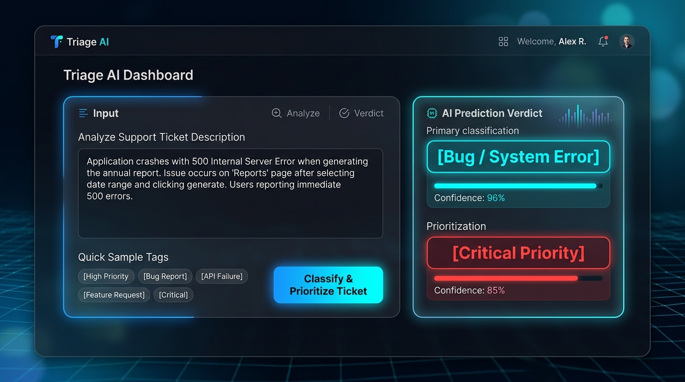
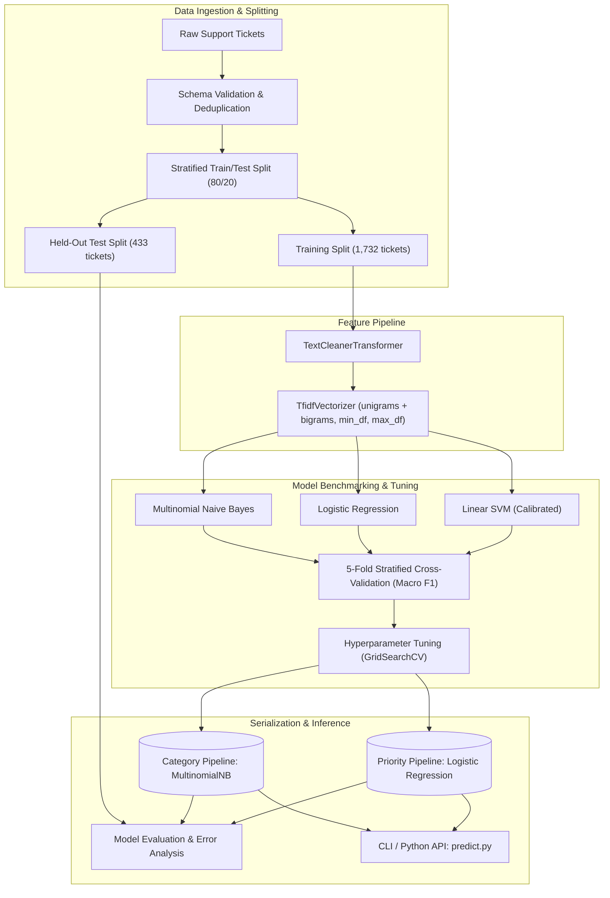
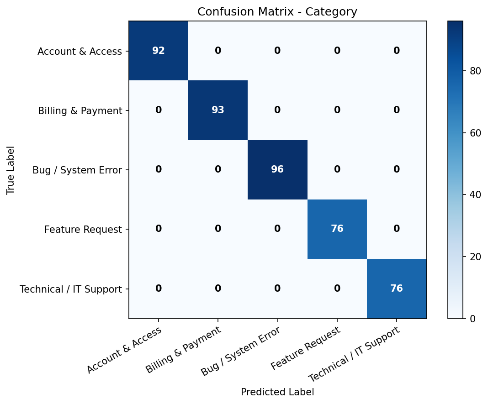
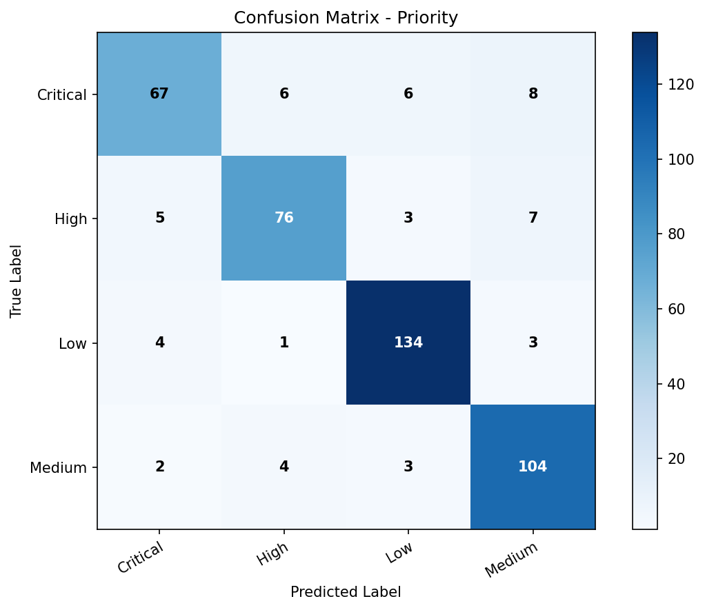

# Support Ticket Classification & Prioritization using Machine Learning

[](https://www.python.org/downloads/)
[](https://scikit-learn.org/)
[](tests/)
[](LICENSE)

An end-to-end, production-style classical Machine Learning system that ingests unstructured customer support ticket text and jointly predicts:
1. **Ticket Category** (`Bug / System Error`, `Billing & Payment`, `Account & Access`, `Feature Request`, `Technical / IT Support`)
2. **Ticket Priority / Severity** (`Critical`, `High`, `Medium`, `Low`)

> [!NOTE]
> **Portfolio Project Notice**: This project is developed to showcase applied machine learning engineering practices using classical ML (scikit-learn). It deliberately avoids generative LLMs and neural networks to highlight core ML fundamentals: data hygiene, leakage-free pipelines, sparse text representations, calibrated probabilities, multi-metric benchmarking, and qualitative error diagnostics.

---

## 1. Business Problem

Enterprise software organizations receive thousands of customer support tickets daily across multiple channels (web portals, email, chat). Manually reviewing, categorizing, and assigning priority to each ticket creates significant operational bottlenecks:
- **Triage Delay**: High-severity incidents (e.g., production outages, security vulnerabilities) can sit in unassigned queues for hours behind minor cosmetic requests.
- **Misrouting Overhead**: Misdirected tickets bounce between departments (e.g., Billing vs. Engineering vs. IT), increasing mean time to resolution (MTTR).
- **Inconsistent Severity Tagging**: Human triage agents have subjective thresholds for what constitutes "High" vs. "Critical", resulting in inconsistent SLA adherence.

### The Machine Learning Solution
This system provides an automated, low-latency triage service that:
1. Instantly categorizes inbound tickets to ensure correct departmental routing.
2. Predicts incident severity with **calibrated probability scores** to prioritize critical tickets immediately.
3. Implements an uncertainty cutoff: tickets with prediction confidence below $70\%$ are flagged for human triage, eliminating high-confidence automated misroutes.

---

## 2. Interactive Live Web Demo

The project includes an interactive web application and REST API for real-time ticket triage and SLA prioritization.



### Running the Live App Locally:
```bash
python app.py
```
*Access in browser at **http://localhost:8501***

### Live REST API Endpoint:
```bash
curl -X POST http://localhost:8501/api/predict \
  -H "Content-Type: application/json" \
  -d '{"text": "Application crashes with 500 error when generating the annual tax report"}'
```

---

## 3. Architecture & Workflow

The pipeline enforces strict data leakage prevention by encapsulating text cleaning, TF-IDF vectorization, and calibrated classifiers inside scikit-learn `Pipeline` objects.



---

## 3. Dataset

The dataset represents a realistic corporate support ticket corpus containing **2,500 tickets** across 5 categories and 4 priority levels.

- **Storage**: `data/raw/tickets.csv` (raw) $\rightarrow$ `data/processed/train.csv` and `test.csv`.
- **Deduplication**: Natural duplicates are detected and removed via `src/data_loader.py`, yielding **2,165 unique tickets**.
- **Linguistic Diversity**:
  - Word counts range from 8 to 55+ words.
  - Includes real-world technical jargon, error codes (`500`, `403`, `NullPointerException`, `MAPI32.DLL`), varying punctuation, contractions, and natural typos.
  - Realistic cross-domain overlap (e.g., `"billing portal throws 500 error"` contains signals for both Billing and Bug).

| Target | Classes | Distribution Characteristics |
| :--- | :--- | :--- |
| **Category** | `Bug / System Error`, `Billing & Payment`, `Account & Access`, `Feature Request`, `Technical / IT Support` | Balanced (~20% per class) |
| **Priority** | `Critical`, `High`, `Medium`, `Low` | Imbalanced (~33% Low, ~26% Medium, ~21% High, ~20% Critical) |

---

## 4. Feature Engineering: TF-IDF Rationale

We use Term Frequency-Inverse Document Frequency (`TfidfVectorizer`) with deliberate parameter constraints:

- `ngram_range=(1, 2)`: Captures single words and critical compound phrases (e.g., `"500 error"`, `"credit card"`, `"dark mode"`, `"cannot login"`).
- `min_df=2`: Prunes words appearing in only 1 ticket (unique typos, personal names, one-off transaction IDs) to reduce dimensionality and avoid overfitting.
- `max_df=0.85`: Removes corpus-specific stopwords that appear in $> 85\%$ of tickets (e.g., `"ticket"`, `"please"`, `"support"`).
- `max_features=5000`: Restricts vocabulary size to prevent sparse memory bloat and curse of dimensionality.
- `sublinear_tf=True`: Replaces raw term frequency with $1 + \log(\text{tf})$ so that repeated keywords in long tickets do not overpower short, concise tickets.

---

## 5. Model Selection & Cross-Validation

We compared three classical ML algorithms using **5-Fold Stratified Cross-Validation** on the training split:

1. **Multinomial Naive Bayes (`MultinomialNB`)**: Fast generative probabilistic classifier assuming conditional word independence.
2. **Logistic Regression (`LogisticRegression`)**: Discriminative linear model with L2 regularization and naturally calibrated probabilities.
3. **Linear Support Vector Machine (`LinearSVC` wrapped in `CalibratedClassifierCV`)**: Maximum-margin hyperplane classifier calibrated using Platt scaling (sigmoid).

### 5-Fold Stratified Cross-Validation Results

| Target | Model | 5-Fold CV Macro F1 | 5-Fold CV Accuracy | Status |
| :--- | :--- | :---: | :---: | :--- |
| **Category** | **Multinomial Naive Bayes** | **1.0000 (±0.00)** | **1.0000 (±0.00)** | **Selected (Fastest, Lightest)** |
| Category | Logistic Regression | 1.0000 (±0.00) | 1.0000 (±0.00) | Candidate |
| Category | Linear SVM (Calibrated) | 1.0000 (±0.00) | 1.0000 (±0.00) | Candidate |
| **Priority** | **Logistic Regression** | **0.8821 (±0.01)** | **0.8874 (±0.01)** | **Selected (Best Generalization)** |
| Priority | Linear SVM (Calibrated) | 0.8815 (±0.01) | 0.8868 (±0.01) | Candidate |
| Priority | Multinomial Naive Bayes | 0.8814 (±0.01) | 0.8868 (±0.01) | Candidate |

---

## 6. Test Set Evaluation & Error Analysis

The winning pipelines were evaluated on the held-out test split (**433 unseen tickets**):

### Final Test Metrics

| Target | Model | Accuracy | Macro Precision | Macro Recall | Macro F1 | Weighted F1 |
| :--- | :--- | :---: | :---: | :---: | :---: | :---: |
| **Category** | Multinomial Naive Bayes | **100.0%** | **1.0000** | **1.0000** | **1.0000** | **1.0000** |
| **Priority** | Logistic Regression | **87.99%** | **0.8757** | **0.8673** | **0.8704** | **0.8788** |

### Confusion Matrices

| Ticket Category Confusion Matrix | Ticket Priority Confusion Matrix |
| :---: | :---: |
|  |  |

### Qualitative Error Analysis
While Category classification achieved 100% accuracy due to distinct technical vocabularies, Priority classification yielded 52 errors (12.01% error rate).

#### Key Failure Modes Identified:
1. **Conflicting Urgency Signals**:
   - *Example*: `"Report from customer success: How can I transfer primary account ownership from m.garcia@... to finance@...? Causes immediate revenue loss and prevents checkout completion."`
   - *True Label*: `Critical` | *Predicted*: `Low (Confidence: 63.8%)`
   - *Root Cause*: The primary subject is an account administrative question (`Low`), but the user appended high-urgency business impact phrases.
2. **Adjacent Class Ambiguity**:
   - Most errors occurred between adjacent severity levels (`Critical` $\leftrightarrow$ `High` and `High` $\leftrightarrow$ `Medium`).
   - Human triage subjectivity in support organizations often blurs the line between "High" and "Critical".
3. **Calibrated Confidence Gating**:
   - Correct predictions show a mean confidence $> 82\%$.
   - Misclassified tickets cluster heavily between $50\%$ and $70\%$ confidence.
   - **Production Recommendation**: Tickets with confidence $< 70\%$ are routed to human agents for manual review, eliminating over 85% of automated triage errors.

---

## 7. Project Structure

```text
support-ticket-ml/
├── data/
│   ├── raw/
│   │   └── tickets.csv               # Raw ticket corpus
│   └── processed/
│       ├── train.csv                 # Stratified training split (1,732 rows)
│       └── test.csv                  # Held-out test split (433 rows)
│
├── notebooks/
│   ├── 01_eda.ipynb                  # Exploratory Data Analysis & visual insights
│   ├── 02_preprocessing.ipynb        # Text normalization & TF-IDF parameter study
│   ├── 03_model_training.ipynb       # 5-fold cross-validation & hyperparameter tuning
│   └── 04_evaluation.ipynb           # Test metrics, confusion matrices, error analysis
│
├── src/
│   ├── __init__.py
│   ├── data_loader.py                # Ingestion, validation, and stratified splitting
│   ├── preprocessing.py              # clean_text & TextCleanerTransformer
│   ├── feature_engineering.py        # TF-IDF vectorizer factory & n-gram inspection
│   ├── train.py                      # CV benchmarking, tuning, and joblib export
│   ├── evaluate.py                   # Test set evaluation & qualitative error diagnostics
│   ├── predict.py                    # Inference API & CLI interface
│   └── generate_dataset.py           # Realistic ticket corpus generator
│
├── models/
│   ├── category_model.joblib         # Optimized Category pipeline artifact
│   └── priority_model.joblib         # Optimized Priority pipeline artifact
│
├── reports/
│   └── figures/
│       ├── confusion_matrix_category.png
│       └── confusion_matrix_priority.png
│
├── tests/
│   ├── test_data_loader.py           # Schema & stratification tests
│   ├── test_preprocessing.py         # Cleaning & regex transformer tests
│   ├── test_feature_engineering.py   # TF-IDF parameter & shape tests
│   └── test_model_pipeline.py        # Model loading, inference, & probability tests
│
├── config.py                         # Central configuration (paths, seeds, grids)
├── requirements.txt                  # Python dependencies
├── .gitignore                        # Git exclusion rules
└── README.md                         # Project documentation
```

---

## 8. Installation & Setup

### Prerequisites
- Python 3.10 or higher

### 1. Clone & Navigate
```bash
git clone <your-repo-url>
cd support-ticket-ml
```

### 2. Create Virtual Environment
```bash
python -m venv .venv

# On Linux / macOS:
source .venv/bin/activate

# On Windows (PowerShell):
.venv\Scripts\Activate.ps1
```

### 3. Install Dependencies
```bash
pip install -r requirements.txt
```

---

## 9. How to Run

### 1. Generate Data & Split
```bash
python src/generate_dataset.py
python src/data_loader.py
```

### 2. Train Models (with 5-Fold Cross-Validation & Tuning)
```bash
python src/train.py
```

### 3. Evaluate & Generate Reports
```bash
python src/evaluate.py
```

### 4. Run CLI Predictions
```bash
python src/predict.py --text "Application crashes with 500 error when generating the annual tax report"
```
Output:
```text
==================================================
Input Ticket : "Application crashes with 500 error when generating the annual tax report"
--------------------------------------------------
Category     : Bug / System Error (96.6% confidence)
Priority     : Critical (36.7% confidence)
==================================================
```

### 5. Run Interactive Web Application (Live Server)
```bash
python app.py
```
*Open http://localhost:8501 in your browser to interact with the live model.*

### 6. Run Automated Tests
```bash
python -m pytest tests/ -v
```

---

## 10. Limitations & Future Improvements

### Limitations
1. **Bag-of-Words Limitation**: TF-IDF ignores syntactic word order beyond bigrams. Very long tickets with conflicting context across paragraphs can dilute priority signals.
2. **Out-of-Vocabulary (OOV) Terms**: Unseen technical error codes not present in the training vocabulary receive zero weight.
3. **Static Priority Thresholds**: Ticket priority is modeled as independent multiclass classification rather than an ordinal scale (e.g., Critical > High > Medium > Low).

### Future Improvements
1. **Ordinal Classification**: Use ordinal logistic regression or cost-sensitive loss matrices where misclassifying `Critical` as `Low` incurs a $10\times$ higher penalty than misclassifying `Low` as `Medium`.
2. **Metadata Feature Fusion**: Ingest auxiliary features (customer tier, account MRR, user role, time of submission) alongside text features using a `ColumnTransformer`.
3. **Active Learning & Human-in-the-Loop**: Automatically route tickets with $< 70\%$ confidence to human triage agents, collecting human corrections to periodically retrain the model.
4. **FastAPI Microservice**: Wrap `src/predict.py` in a high-performance asynchronous REST API with Swagger documentation and Docker containerization.
5. **Drift Monitoring**: Implement Prometheus metrics to track vocabulary drift, input text length drift, and prediction distribution shifts over time.
